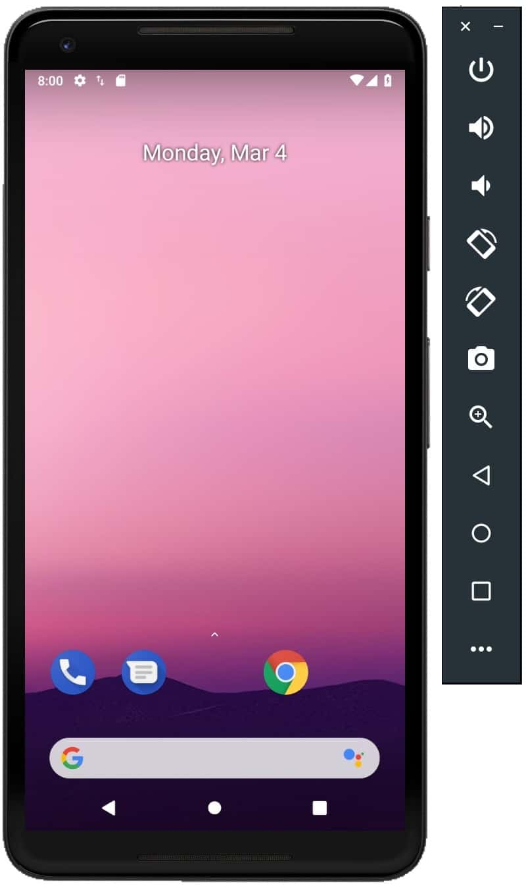
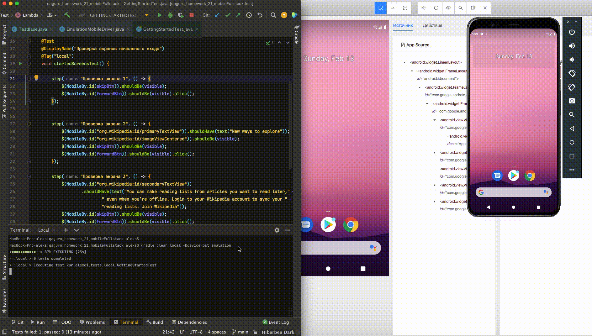

<h1>Проект автоматизации тесткейсов для приложения Wikipedia на платформе Android.</h1>

Спроектирован прогон тестов на разных стендах:

<h4>При выполнении проекта проделана следующая работа:</h4>
<pre>
1.Установлен android studio https://developer.android.com/studio
2.Прописаны path на macOs:
Параметры Path:
Windows:
%ANDROID_HOME%\tools
%ANDROID_HOME%\tools\bin
%ANDROID_HOME%\platform-tools
Одной строкой, можно скопировать и добавить в конец Path: ;%ANDROID_HOME%\tools;%ANDROID_HOME%\tools\bin;%ANDROID_HOME%\platform-tools
Mac:
$ANDROID_HOME/tools
$ANDROID_HOME/tools/bin
$ANDROID_HOME/platform-tools
Одной строкой, можно скопировать и добавить в .bash_profile:
export PATH=”${PATH}:/$ANDROID_HOME/tools:/$ANDROID_HOME/tools/bin:/$ANDROID_HOME/platform-tools”
3.Установлен appium desktop https://github.com/appium/appium-desktop
4.В android studio -> SDK Manager смонтирован 11 андроид
5.В AVD Manager смонтирован образ Pixel 4 для 11 андроида
6.Использован эмулятор телефона
7.Использован Appium Desktop, по Appium server установлена связь с эмулятором
8.С помощью appium desktop инспектор определены локаторы для тесткейсов
9.Разработатны автотесты на getting started в приложении  - проход по 4м экранам, на каждом сделаны проверки
10.Настроена возможность запуска на разных стендах по параметру из командной строки -DdeviceHost=browserstack / selenoid / emulation / real
Для каждого сделан драйвер и конфиг с owner
</pre>

<h4> Пример запуска тестов на эмуляторе Андроид локально</h4>
<h5> Тестовый прогон по task emulation для настрoек драйвера эмулятора через переменную -DdeviceHost=emulation. </h5>
Команда для запуска gradle clean emulation

<code>

</code>

Jenkins Job
https://jenkins.autotests.cloud/job/C09-alexqur-hw21-mobile/
